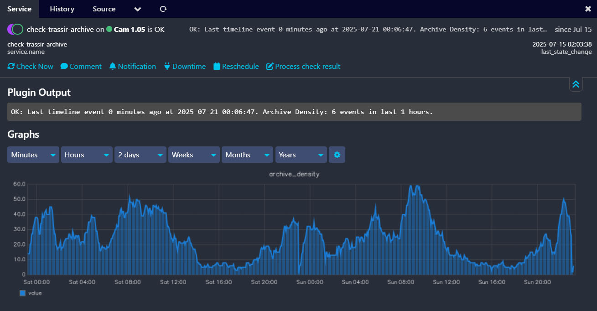
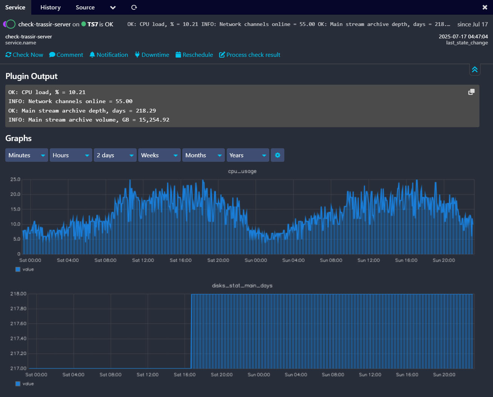

# check_trassir

This plugin checks the health and archive status of a Trassir NVR system via its public API. It supports both **server health mode** and **channel archive analysis mode**, compatible with **Nagios** and **Icinga2**.

[](https://github.com/xyhtac/check_trassir/releases/tag/v.1.11)

---

### Execution modes

#### Channel Archive Check:
[](img/check-trassir-archive.jpg "Screenshot - Channel check mode")

> channel mode usage example:
```bash
./check_trassir.php --host 10.0.1.1 --port 8080 --username username --password secret_password --channel Camera-1 --hours 8 --timezone 3
```

#### Server Health Check:
[](img/check-trassir-server.jpg "Screenshot - Channel trassir server")

> server mode usage example:
```bash
./check_trassir.php --host 10.0.1.1 --port 8080 --username username --password secret_password
```

> **_NOTE:_** Use the `--channel` argument to switch between modes.  If omitted, plugin runs in **server mode**. Use '--debug 1' to get detailed API output.

---

### Dependencies

This plugin is written in PHP and requires the following:
- PHP 5.3+
- PHP cURL Extension
- OpenSSL support in PHP

#### Install on Debian/Ubuntu:

```bash
sudo apt update
sudo apt install -y php php-curl php-openssl
```

#### Install on RHEL/CentOS:

```bash
sudo yum install -y php php-curl openssl
```

---

### Plugin Installation

1. Clone the repository to your home directory:
```bash
cd ~
git clone https://github.com/xyhtac/check_trassir.git
```

2. Copy the plugin script to the Nagios plugins directory (usually /usr/lib/nagios/plugins/):
```bash
sudo cp ~/check_trassir/check_trassir.php /usr/lib/nagios/plugins/
sudo chmod 755 /usr/lib/nagios/plugins/check_trassir.php
```

3. Ensure the script is executable and accessible by Nagios/Icinga.
```bash
sudo chmod 755 /usr/lib/nagios/plugins/check_trassir.php
sudo chown icinga:icinga /usr/lib/nagios/plugins/check_trassir.php
```

---

### Icinga2 Configuration

You can either paste the following definitions into `services.conf` and `commands.conf`, **or** place them in a dedicated file like `conf.d/trassir-checker.conf`

---

#### Archive channel checker definition
add to your `services.conf`

```icinga
apply Service "check-trassir-archive" {
  import "generic-service"
  check_interval = 30m
  retry_interval = 3m
  check_timeout = 1m
  vars.server_host = get_host(host.vars.server)
  vars.host = vars.server_host.address
  vars.port = vars.server_host.vars.trassir["port"]
  vars.timezone = vars.server_host.vars.trassir["timezone"]
  vars.username = vars.server_host.vars.trassir["username"]
  vars.password = vars.server_host.vars.trassir["password"]
  vars.trassir_archive_checker = true
  vars.channel = host.vars.trassir["channel"]
  vars.hours = ""
  if (host.vars.trassir["hours"] != null && host.vars.trassir["hours"] != "") {
    vars.hours = host.vars.trassir["hours"]
  } else {
    vars.hours = "24"
  }
  enable_perfdata = true
  check_command = "check_trassir"
  assign where host.vars.trassir["channel"] && host.vars.server
}

apply Dependency "mute-check-trassir-archive-if-server-down" to Service {
  disable_checks = true
  disable_notifications = true
  parent_host_name = host.vars.server
  assign where host.vars.trassir["channel"] && host.vars.server
}
```

---
#### Server checker definition
add to your `services.conf`

```icinga
apply Service "check-trassir-server" {
  import "generic-service"
  check_interval = 10m
  retry_interval = 3m
  check_timeout = 1m
  vars.host = host.address
  vars.port = host.vars.trassir["port"]
  vars.timezone = host.vars.trassir["timezone"]
  vars.username = host.vars.trassir["username"]
  vars.password = host.vars.trassir["password"]
  vars.trassir_server_checker = true
  enable_perfdata = true
  check_command = "check_trassir"
  assign where host.vars.trassir["username"] && host.vars.trassir["password"]
}
```

---

#### Command Definition
add to your `commands.conf`

```icinga
object CheckCommand "check_trassir" {
  import "plugin-check-command"
  command = [ PluginDir + "/check_trassir.php" ]
  arguments = {
    "--hours" = "$hours$"
    "--host" = "$host$"
    "--port" = "$port$"
    "--username" = "$username$"
    "--password" = "$password$"
    "--channel" = "$channel$"
    "--timezone" = "$timezone$"
    "--delay" = "$delay$"
  }
  vars.enable_perfdata = true
}
```

Don't forget to **restart Icinga2**:

```bash
sudo systemctl restart icinga2
```

---

### License

This repository is distributed under the **Apache License 2.0**.  
See the [LICENSE](./LICENSE) file for full terms and conditions.

---

### Disclaimer

This plugin is developed independently and is based on the publicly available **Trassir API SDK**, as documented at:
https://trassir.com/software-updates/manual/sdk.html


Please be aware of:
- The Trassir API SDK is subject to change without prior notice by its maintainers. This may impact the compatibility or functionality of this plugin in the future.
- This project is **not affiliated with, endorsed by, or officially supported by DSSL or Trassir**.
- "Trassir" and its associated logos and trademarks are the **intellectual property of DSSL** (https://www.dssl.ru/). All rights to those names and marks are reserved by their respective owners.
- The authors of this plugin **make no guarantees regarding its fitness** for any particular purpose and **are not liable for any damages** resulting from its use.

---

### Bugs and feature requests

Please report bugs [here on Github](https://github.com/xyhtac/check_trassir/issues).
Guidelines for bug reports:
1. Use the GitHub issue search — check if the issue has already been reported.
2. Check if the issue has been fixed — try to reproduce it using the latest master or development branch in the repository.
3. Isolate the problem — create a reduced test case and a live example. 

A good bug report shouldn't leave others needing to chase you up for more information.
Please try to be as detailed as possible in your report.
Feature requests are welcome. Please look for existing ones and use GitHub's "reactions" feature to vote.


